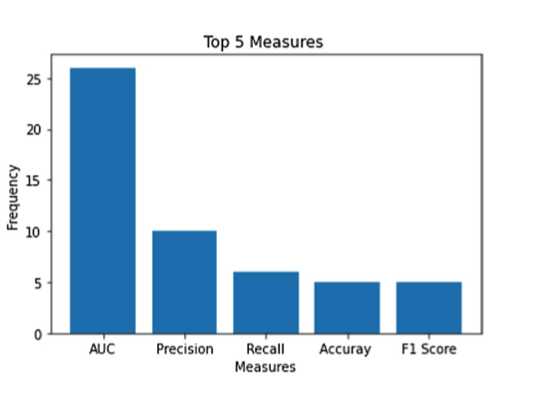
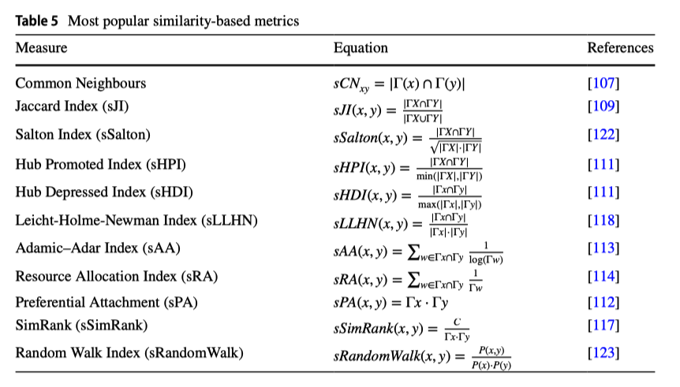

# A comprehensive survey of link prediction methods

## 1. 定义

链路预测旨在基于节点之间的先前交互和网络结构，预测未来两个节点之间形成连接的概率。

## 2. 用处

- 推荐算法
- 刑事判断
- 安全领域 -- 预测节点的可信度

## 3. info

### 网络的分类

- #### 静态网络

静态网络是一种不会随时间变化的网络，节点和边保持不变。一些作者提出过一种基于节点流行度的静态网络链接预测方法。

- #### 动态网络

动态网络是一种随时间变化的网络，随着网络的进展，新的节点和边会出现或消失。在链接预测中，动态网络用于表示节点之间随时间变化的关系，如社交网络中的人际交往。

- #### 直接和间接网络

社交网络可以被认为是直接或间接的网络。直接网络具有非对称性链接，如Twitter。用户A可以关注用户B，或者用户B可以关注A。间接网络具有对称性链接，如Facebook。

- #### 加权网络

加权网络是一种节点之间的链接具有权重的网络，这些权重可以表示关系的不同方面，如强度或重要性。为了预测节点之间的链接，链接预测算法经常使用加权网络来捕捉它们的关系。

- #### 多重网络

多重网络是一种具有多层的网络，每一层表示节点之间的不同类型的关系或交互。节点通过不同层中的多种类型的边进行连接，捕捉它们的多维关联。

- #### 知识网络

知识网络是一个由实体和关系组成的多关系图，实体和关系分别被视为节点和不同类型的边。

- #### 签名网络

签名网络是一种边具有正权重或负权重的网络。在社交网络分析中，边的正权重表示友谊，负权重表示敌意。

- #### 自我网络

自我网络是一个直接连接到中心节点（称为自我）的网络节点簇。

- #### 异构网络

异构网络，也称为异构信息网络或多模态网络，具有多种类型的节点和边。

### 度量方法

#### 面积下的曲线（AUC）

**定义**：

- AUC（Area Under the Curve）是ROC曲线（Receiver Operating Characteristic Curve）下面积的度量。ROC曲线描绘了模型的真阳性率（TPR）和假阳性率（FPR）之间的关系。

**计算公式**： $AUC = \frac{n' + 0.5n''}{n}$​​

- 其中，n′ 是缺失链接得分高于不存在链接的次数，n′′ 是它们得分相等的次数，n 是总比较次数。

**意义**：

- AUC值越高，表明算法在区分正负链接（即存在链接和不存在链接）方面的能力越强。一个完全随机的模型AUC值约为0.5，高于此值表明模型优于随机预测。

#### 准确率（Accuracy）

**定义**：

- 准确率是模型正确分类的链接占总链接的比例。

**计算公式**： $Accuracy = \frac{TP + TN}{TP + TN + FP + FN}$​

- 其中，TP（True Positive）是正确预测的正链接数，TN（True Negative）是正确预测的负链接数，FP（False Positive）是错误预测的正链接数，FN（False Negative）是错误预测的负链接数。

**意义**：

- 准确率表示模型整体的预测正确性，但在类别不平衡的数据集上，准确率可能会产生误导。

#### 精确率（Precision）

**定义**：

- 精确率是正确分类的正链接占所有分类为正链接的比例。

**计算公式**： $Precision = \frac{TP}{TP + FP}$

**意义**：

- 精确率表示在所有预测为正链接的结果中，有多少是实际存在的链接。高精确率意味着模型在预测正链接时错误较少。

#### 召回率（Recall）

**定义**：

- 召回率是正确分类的正链接占所有实际正链接的比例。

**计算公式**： $Recall = \frac{TP}{TP + FN}$

**意义**：

- 召回率表示在所有实际存在的正链接中，有多少被正确预测出来。高召回率意味着模型在识别正链接时遗漏较少。

#### F1分数（F1 Score）

**定义**：

- F1分数是精确率和召回率的调和平均数，用于平衡两者的重要性。

**计算公式**： $F1 = 2 \times \frac{Precision \times Recall}{Precision + Recall}$​

**意义**：

- F1分数在精确率和召回率之间取得平衡，当两者存在权衡时尤为重要。F1分数越高，表示模型在处理不平衡数据集时表现越好。

#### 使用频率：

## 4. Methods for link prediction

### 相似性：

相似性是一种用于评估网络中两个节点之间连接可能性的度量。它经常用于预测当前在网络中未连接的两个节点之间形成链接的可能性。

**指标：**（比较老，与其他配合依然在使用）

- 局部指标：共同邻居（CN）、Jaccard指数、Adamic-Adar指数和资源分配指数
- 准局部指标：局部随机游走（LRW）和局部路径指数（LPI）
- 全局指标：Katz、随机游走、SimRank、Leicht-Holme-Newman指数（LHNI）和矩阵森林指数（MFI）

## 

**共同邻居度惩罚（CNDP）：**

Rafiee S, Salavati C, Abdollahpouri A (2020) Cndp: link prediction based on common neighbors degree penalization. Physica A 539:122950

CNDP算法结合了网络的平均聚类系数和拓扑特征，如共享邻居的数量，来计算节点相似性分数。通过在计算中加入共同邻居，这种方法改进了之前提出的自适应度惩罚（ADP）方法。结果表明，CNDP在准确性和计算效率上相比其他相似技术有显著提高。此外，CNDP同时考虑了网络的本地和全局特征，提供了对网络结构的更全面和细致的检查。

**共同邻居和中心性参数化算法（CCPA）：**

Ahmad I, Akhtar MU, Noor S, Shahnaz A (2020) Missing link prediction using common neighbor and centrality based parameterized algorithm. Sci Rep 10(1):1–9

该算法基于节点的两个关键特征：共同邻居的数量和节点的中心性，中心性通过接近中心性和中介中心性测量。共同邻居特征反映了网络中两个节点之间的共享节点。通过在八个真实世界的数据集上进行实验，评估了CCPA的有效性。

Aziz F, Gul H, Muhammad I, Uddin I (2020) Link prediction using node information on local paths. Physica A 557:124980

作者提出了一种基于节点局部路径信息的新相似性度量。两个节点之间的相似性分数通过在指定距离内的节点局部信息计算，考虑节点之间的直接连接和它们之间的所有其他短路径。这种方法结合了两种知名相似性指数的优点，即Katz指数和Adamic-Adar。

Ayoub J, Lotfi D, El Marraki M, Hammouch A (2020) Accurate link prediction method based on path length between a pair of unlinked nodes and their degree. Soc Netw Anal Min 10(1):1–13

一种基于度和路径深度的无参数新相似性度量。该度量扩展了他们之前的工作（Jibouni等人，[68]），重点是局部特征，如节点度和全局特征，包括路径结构。该度量考虑了不同长度的路径，通过使用长度为2和3的路径，并考虑源节点和目标节点的度数来减少高度节点的影响。作者应用了机器学习技术，如K最近邻、逻辑回归、人工神经网络、决策树、随机森林和支持向量机（SVM）进行二分类。

**多属性决策（MADM）：**

Luo H, Li L, Zhang Y, Fang S, Chen X (2021) Link prediction in multiplex networks using a novel multiple-attribute decision-making approach. Knowl-Based Syst 219:106904

通过将目标层中的潜在链接视为备选项，将网络中的不同层作为属性，目标是有效利用所有层的信息。提出的方法基于理想得分对备选项进行排序，并使用基于余弦相似性的层相似度度量来分配层的权重。大量实验表明，提出的方法在准确性和运行时间上优于竞争对手的方法。

Zou L, Wang C, Zeng A, Fan Y, Di Z (2021) Link prediction in growing networks with aging. Soc Netw 65:1–7

作者提出了一种用于增长网络的模型，并引入了新颖的时间片度量来估计缺失链接的可能性。这些度量基于建立在现有链接预测指数之上的新方法，相比现有方法，特别是当衰减因子较小时，表现出更优越的性能。此外，论文还提出了用于确定真实网络中最佳切片数量和衰减因子的函数表达式，提高了链接预测的效率。通过利用这些公式，方法能够通过估计增长网络的老化速度，准确高效地预测缺失链接。实现步骤和时间片度量的优势通过偏好连接度量进行了示例，进一步展示了其在老化站点网络中的有效性。

### 机器学习

- **监督学习**

$$
s(x, y) = \begin{cases} 
+1 & \text{if } (x, y) \in E \\
-1 & \text{if } (x, y) \notin E 
\end{cases}
$$

Shan N, Li L, Zhang Y, Bai S, Chen X (2020) Supervised link prediction in multiplex networks. Knowl-Based Syst 203:106168

应用了SVM、随机森林和Adaboost算法到一个多重网络中。这项研究采用了混合方法，结合了不同的相似性度量，包括局部和全局，以创建节点对的特征向量。特征向量包括共同邻居、节点度和聚类系数，以及两个新特征，“邻域友谊(FoN)”和“辅助层中的友谊(FAL)”，这些考虑了多重网络中所有层的结构信息。然后将特征向量输入分类器以预测节点对之间的关系。通过在六个多重网络上进行实验，并将结果与NSILR[37]方法进行比较，评估了这种方法的有效性。这种方法展示了整合所有层的结构信息并避免参数设置问题的好处。

Giubilei R, Brutti P (2022) Supervised classification for link prediction in facebook ego networks with anonymized profile information. J Classif 5:1–24

将二元分类方法应用于社交网络中的自我网络。这种方法从基于同质性理论的用户档案中提取年龄和位置等特征。这种方法使用基于相似性的方法与各种监督学习算法相结合，包括自适应增强(AB)、极端随机树、梯度增强(GB)、K最近邻(KNN)、线性判别分析(LD)、逻辑回归(LR)、朴素贝叶斯分类器(NB)、神经网络(NN)、随机森林(RF)、支持向量机(SVM)和极端梯度增强(XG)。提出的方法报告说，使用极端梯度增强方法获得了最高的准确性。这种方法的优点在于它使用了从用户档案中提取的基本相似性信息，这些信息不能仅从图结构中推断出来。然而，值得注意的是，这些信息可能并不总是可用或正确，这可能影响预测的准确性。

- **XGBOOST分类器**

Daud NN, Hamid SHA, Seri C, Saadoon M, Anuar NB (2022) Scalable link prediction in twitter using self-configured framework. arXiv preprint arXiv:2208.09798

一个与Spark集成的自配置框架(SCF)，用于增强大规模社交网络中的链接预测。SCF根据数据集大小、工作负载和集群规格自动配置最佳设置。它利用XGBoost分类器预测每个节点的最佳执行器数量。该框架展示了预测时间减少了40%，并且平衡了资源消耗，有效利用了有限的集群。与手动配置相比，SCF提供了优势，提高了性能和预测质量，而无需大量的硬件设置。

- **无监督学习**

Muniz CP, Goldschmidt R, Choren R (2018) Combining contextual, temporal and topological information for unsupervised link prediction in social networks. Knowl-Based Syst 156:129–137

基于加权概念的无监督链接预测上下文-时间-拓扑（CTT）标准。这个加权概念侧重于三个加权标准：时间-拓扑、上下文-拓扑和上下文-时间-拓扑。CTT标准合并了这三个加权标准，与仅基于这些加权标准而不结合它们的其他方法不同。

Ghorbanzadeh H, Sheikhahmadi A, Jalili M, Sulaimany S (2021) A hybrid method of link prediction in directed graphs. Expert Syst Appl 165:113896

提出了一种方法来解决两个节点没有共同邻居，即它们不总是可以预测将来会链接的问题。他们考虑了邻域方向以及邻居的中心和权威性。这种方法的性能通过使用监督和无监督预测模型进行了评估，并与几种广泛使用的基线方法进行了比较，如Node2Vec、DeepWalk、LINE和M-NMF。

Mavromatis C, Karypis G (2021) Graph infoclust: maximizing coarse-grain mutual information in graphs. In Pacific-Asia Conference on Knowledge Discovery and Data Mining, pp 541–553. Springer

应用了流行的无监督学习算法K-means，使用一种称为Graph InfoClust（GIC）的图表示学习方法。K-means算法用于基于同时互信息最大化计算聚类。GIC的性能与其他无监督方法如深度图infomax、变分图自编码器、对抗性正则化图自编码器、DeepWalk、深度神经网络图表示和谱聚类进行了比较。

- **深度学习**

  Zhang M, Chen Y (2017) Weisfeiler-lehman neural machine for link prediction. In Proceedings of the 23rd ACM SIGKDD International Conference on Knowledge Discovery and Data Mining, pp 575–583

  介绍了Weisfeiler-Lehman神经机器（WLNM），这是一种用于链接预测的深度学习方法。WLNM方法使用全连接神经网络识别与链接存在高度相关的局部封闭子图。通过将这些子图作为训练数据提取，该技术在链接预测方面取得了令人印象深刻的结果，超过了其他最先进的方法。

  

  Zhang M, Chen Y (2018) Link prediction based on graph neural networks. Adv Neural Inf Process Syst 31:25

  提出了一种称为SEAL的新型链接预测方法。这种方法解决了之前提出的Weisfeiler-Lehman神经机器（WLNM）方法[74]的局限性。SEAL通过使用图神经网络（GNN）而不是全连接神经网络来学习局部封闭子图的图结构特征，从而改进了WLNM。这使得SEAL能够学习来自潜在和显式节点属性以及子图拓扑结构的特征。为了展示其统一各种高阶启发式、潜在特征技术、和网络嵌入算法的能力，SEAL提出了一个λ-衰减理论。该方法在八个数据集上进行了测试，并与不同的启发式、潜在特征技术和网络嵌入算法进行了比较。

  

  Chen J, Zhang J, Xu X, Fu C, Zhang D, Zhang Q, Xuan Q (2019) E-lstm-d: a deep learning framework for dynamic network link prediction. IEEE Trans Syst Man Cybern Syst 51(6):3699–3712

  引入了一种编码器-LSTM-解码器(E-LSTM-D)模型，用于动态网络中的链接预测。该方法的创新之处在于将结构和时间特征整合到同一框架中。作者使用编码器-解码器自动描述网络，并使用LSTM通过堆叠和表示一系列图来捕获网络的时间演变。通过新开发的错误率指标评估了模型的有效性。

  

  Rossi E, Chamberlain B, Frasca F, Eynard D, Monti F, Bronstein M (xxxx) Temporal graph networks for deep learning on dynamic graphs

  提出使用时间图网络(TGNs)和深度学习技术进行动态链接预测。为了平衡并行处理效率和从输入的序列性中学习的能力，作者提出了一种新颖的训练方法：TGN。TGN能够记忆图中节点之间的长期依赖关系。作者全面研究了各种框架组件，并评估了速度和准确性的权衡。所提出的模型的性能与静态和动态基线模型进行了比较。

  

  Sankar A, Wu Y, Gou L, Zhang W, Yang H (2020) Dysat: deep neural representation learning on dynamic graphs via self-attention networks. In: Proceedings of the 13th International Conference on Web Search and Data Mining, pp 519–527

  提出了一种新的神经网络架构，称为动态自注意力网络(DySAT)。这种方法捕获了节点的时间动态和结构邻域，并在组合自注意力表示中进行了建模。作者的目标是学习低维向量，以描述节点及其周围环境的结构属性。

  

  Keikha MM, Rahgozar M, Asadpour M (2021) Deeplink: a novel link prediction framework based on deep learning. J Inf Sci 47(5):642–657

  提出了一个名为DeepLink的框架，用于社交网络中的链接预测。该框架利用深度学习从节点的内容和结构信息中提取目标特征。首先，使用Word2Vec框架学习节点的结构特征向量，然后应用Doc2Vec算法学习每个节点的内容信息特征向量。最后，将结构和内容信息的权重向量聚合成单个向量。

  

  Zulaika U, Sanchez-Corcuera R, Almeida A, Lopez-de-Ipina D (2022) Lwp-wl: link weight prediction based on cnns and the weisfeiler-lehman algorithm. Appl Soft Comput 120:108657

  提出了一种基于Weisfeiler-Lehman的链接权重预测(LWP-WL)方法。受到WeisfeilerLehman神经机器的启发，LWP-WL提取了目标链接周围的封闭子图，并应用图标记算法创建有序的子图邻接矩阵。然后，这个矩阵被输入到一个神经网络中，该网络包括一个为输入图表示设计的具有特殊过滤器的卷积神经网络(CNN)层。广泛的评估表明，LWP-WL在各种加权图中的性能超过了最先进的方法。

  

  - **图神经网络**

    图神经网络（GNN）是一种专门设计用于操作图结构化数据的方法。GNN旨在通过特征传播和聚合有效地结合特征信息和图结构，通过迭代更新节点表示来学习更好的节点表示。

    

- **reinforce learning**

### 降维

1. **嵌入方法 (Embedding-based methods)**

嵌入方法通过将网络中的节点映射到低维空间来保留其邻域结构，同时学习图中的信息性特征。这些方法的目标是将原始高维节点表示转换为低维向量，使得在原始网络中特征相似的节点在嵌入空间中彼此接近。嵌入方法包括：

- **随机游走**：基于随机游走的嵌入方法，如DeepWalk和node2vec，通过模拟随机游走者在网络中的移动来捕获节点的局部邻域信息。
- **特征选择**：一些嵌入方法结合了特征选择技术来生成图嵌入，这有助于提高链接预测的准确性。
- **增量嵌入**：如LP-ROBIN方法，它通过增量方式更新模型，以适应网络的动态变化，例如新节点的添加。

2. **矩阵分解方法 (Factorization-based methods)**

矩阵分解方法通过将图表示为一个矩阵并将其分解为较小的矩阵来反映节点的潜在表示。这些方法可以有效地预测缺失的链接。矩阵分解技术包括：

- **非负矩阵分解** (NMF)：如NMF-AP和MS-RNMF方法，它们结合了局部和全局网络结构的信息，使用PageRank和非对称链接聚类系数等技术来提高预测精度。
- **多非负矩阵分解**：用于冷启动问题，整合了社区成员身份、属性相似性和一阶结构特征，以预测断开连接的网络结构中缺失的链接。
- **图正则化非负矩阵分解**：如GNMFCA模型，它结合了局部和全局时序网络信息，通过PageRank中心性和图正则化来优化链接预测。

### other plan

Moutinho JP, Melo A, Coutinho B, Kovács IA, Omar Y (2023) Quantum link prediction in complex networks. Phys Rev A 107(3):032605

提出了一种设计用于多种网络中基于路径的链接预测的量子算法QLP。QLP使用受控连续时间量子行走对偶数和奇数长度路径的预测得分进行编码。通过经典模拟，它展示了与建立的基于路径的预测器相当的性能。该提议突出了QLP在链接预测中实现量子加速的潜力，这通过使用量子计算技术进行计算和预测，与传统方法有所区别。

Kumar M, Mishra S, Biswas B (2022) Pqklp: projected quantum kernel based link prediction in dynamic networks. Comput Commun 196:249–267

提出了一种使用量子核增强的机器学习模型进行链接预测的新策略，该模型结合了局部和全局信息进行特征生成。目标是开发一种量子辅助的基于特征的方法，将投影量子核（PQK）与机器学习模型结合起来，以提高预测性能。通过利用高维希尔伯特空间和类似于量子力学的数学结构，所提出的方法增强了数据，以实现更准确的链接预测。实验结果表明，量子增强模型，如PQK-神经网络和PQK-随机森林分类器，优于相应的经典机器学习。动态数据集的比较分析证明了量子辅助方法优于单个链接预测方法和最先进的方法。

主要内容

1. **链接预测的定义与应用**
   - 链接预测任务通过考虑节点间的历史交互和网络拓扑，估计未来连接的概率。广泛应用于推荐系统、社交网络、刑事网络、安全领域等。
   - 预测准确的链接有助于理解网络结构和动态，从而更好地预测其未来行为。
2. **链接预测方法分类**
   - **基于相似度的方法**：利用节点间的相似性进行预测，包括本地索引（如共同邻居）、准本地索引（如局部路径指数）和全局索引（如Katz指数）。
   - **降维方法**：通过嵌入和矩阵分解技术，将高维网络数据转化为低维表示，便于链接预测。
   - **机器学习方法**：包括监督学习、无监督学习、强化学习和深度学习，尤其是图神经网络的应用。
   - **其他方法**：例如基于社区检测和随机游走的方法。
3. **机器学习与深度学习在链接预测中的应用**
   - **监督学习**：通过标记数据训练分类器预测链接，如支持向量机（SVM）、随机森林（RF）等。
   - **无监督学习**：利用未标记数据进行聚类和特征提取，如K-means聚类。
   - **深度学习**：自动学习图结构特征，通过神经网络进行链接预测，如SEAL方法、LSTM模型。
   - **图神经网络（GNN）**：通过传播和聚合节点及其邻居的信息，学习节点的低维表示，如CPAGCN方法、STEM-GCN模型。
4. **图神经网络（GNN）方法**
   - GNN方法在捕捉图的结构信息方面具有显著优势，能够有效处理稀疏图，并通过聚合邻居节点的信息，捕捉复杂的网络特征。
   - 尽管GNN在链接预测中表现优异，但其在处理超大规模图时存在计算和内存要求高的问题，且在小规模和噪声数据集上容易过拟合。
